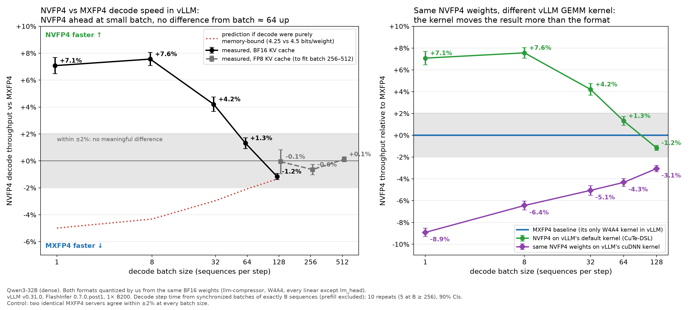
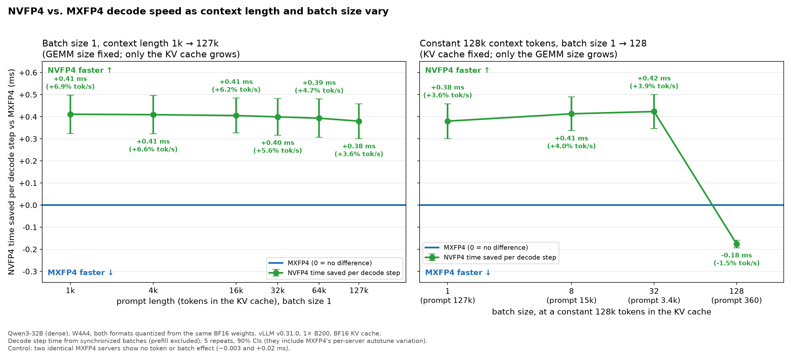

# decodebench - LLM decode speed on real serving stacks


## Goal

Benchmark realistic LLM workloads (a current, relevant model, served by a real engine, at realistic batch
sizes).

#### NVFP4 vs MXFP4 TL;DR — _Last updated October 2026_

- **([Benchmark your workload](https://x.com/StasBekman/status/2107221020197429422?s=20))**.
  Decode performance differences seem to primarily depend on the kernel implementations for the dtypes, albeit we only tested NVFP4 and MXFP4 here. (TODO: test more)
- **LLM Decode using small batches? NVFP4 is faster:** +7.1%, +7.5% and +4.2% decode throughput at
  batch 1, 8 and 32. The difference disappears at higher batch sizes for Qwen3-32B.
- **GEMM-bound? (aka prefill/training)** On large GEMMs NVFP4 delivers ~9% more TFLOPS than MXFP4 in PyTorch
  ([Stas's MAMF numbers](https://github.com/stas00/ml-engineering/blob/master/training/dtype.md#fp4-formats)).
- **Serve NVFP4 on vLLM's default kernel**, CuTe-DSL (`--linear-backend flashinfer_cutedsl`). On
  the cuDNN kernel (`flashinfer_cudnn`) the same weights are 10–18% slower and lose to MXFP4.
  Dense MXFP4 falls back to FlashInfer's `mm_fp4` (CuTe-DSL), which re-autotunes on every
  server start.
- **NVFP4 is also more accurate:** its NLL penalty over BF16 is 2.7× smaller.



*Left: NVFP4's decode-throughput advantage over MXFP4 against batch size (BF16 KV; FP8 KV at
256 and 512), next to what the bytes model predicts. Right: the same NVFP4 weights on vLLM's
CuTe-DSL and cuDNN kernels, both relative to MXFP4.*



*Time NVFP4 saves per decode step. Left: batch 1 while the context grows from 1k to 127k tokens.
Right: batch 1 → 128 at a constant 128k tokens in the KV cache.*

## Results

vLLM v0.31.0 · 1× NVIDIA B200 (SM100) · Qwen3-32B (dense, W4A4) ·

| Date | vLLM | FlashInfer | GPU | Model | NVFP4 decode throughput vs MXFP4 | Details |
|---|---|---|---|---|---|---|
| 2026-10 | 0.31.0 | 0.7.0.post1 | 1× B200 | Qwen3-32B | +7.1 / +7.5 / +4.2% at batch 1 / 8 / 32; within ±2% at 64–512 | [RESULTS.md](RESULTS.md) |

## What we found on vLLM v0.31.0

- **Decode uses only 38–62% of the B200's memory bandwidth.** A bytes model predicted MXFP4, with
  ~6% smaller weights, up to ~5% faster. NVFP4 won.
- **The kernels around the matrix multiplies decide it.** Most of NVFP4's lead comes from
  MXFP4's slower activation quantization, extra small kernels and idle gaps between kernels.
  vLLM's NVFP4-only fused SiLU + quantization adds about 1%.
- **The lead depends on batch size.** At batch 1, NVFP4 saves ~0.4 ms per step at any context
  from 1k to 127k tokens. By batch 128 the lead is gone.
- **At large batch the formats tie.** Stas's MAMF runs showed NVFP4 ~9% faster on large GEMMs;
  in decode at batch 256–512 the two run at the same speed.

*Caveat: two identical MXFP4 servers, our A/A control, differed by 0.3–0.4% at two batch sizes,
enough to fail its pre-registered check, so the main verdict is formally not interpretable. A
post-hoc check gives the same answer. Details in [RESULTS.md](RESULTS.md).*


*Time NVFP4 saves per decode step. Left: batch 1 while the context grows from 1k to 127k tokens.
Right: batch 1 → 128 at a constant 128k tokens in the KV cache.*

## When GEMMs are the bottleneck

Large matrix multiplies (prefill, training, decode at large batch) are compute-bound. There the
library that runs the GEMM decides the result:

| Large GEMMs on B200 | NVFP4 vs MXFP4 | Source |
|---|---|---|
| PyTorch 2.14, MAMF (best shape found) | ~9% more TFLOPS (6,624 vs 6,087; 73.6% vs 67.6% of peak) | [Stas Bekman](https://github.com/stas00/ml-engineering/blob/master/training/dtype.md#fp4-formats) |
| PyTorch 2.13 `_scaled_mm`, M = 512 | 17% / 26% faster on gate_up / qkv; mixed on down | ours |
| vLLM v0.31.0 (FlashInfer CuTe-DSL `mm_fp4`), M = 512 | 4–20% slower on gate_up and down; 2–3% faster on qkv | ours |
| FlashInfer cuDNN, M = 512 | 10–30% faster on every shape | ours |
| End-to-end decode, batch 256 / 512 | within 0.7% | ours |

In PyTorch 2.13 the two formats run in different libraries (NVFP4 in cuBLASLt, MXFP4 in CUTLASS),
so that row compares libraries as much as formats. Our rows are medians that held on two B200s
(they differ by up to ~22% between containers); details in [RESULTS.md](RESULTS.md).

## How it measures

- **Checkpoints.** [MXFP4](https://huggingface.co/ggamecrazy/Qwen3-32B-MXFP4-W4A4) and
  [NVFP4](https://huggingface.co/ggamecrazy/Qwen3-32B-NVFP4-W4A4) are W4A4 quantizations of the
  same BF16 [`Qwen/Qwen3-32B`](https://huggingface.co/Qwen/Qwen3-32B) (llm-compressor 0.14.0,
  every Linear except `lm_head`), served with identical vLLM settings except the checkpoint and
  the kernel. The runs used revisions
  [`9a719cd`](https://huggingface.co/ggamecrazy/Qwen3-32B-MXFP4-W4A4/tree/9a719cda64d8748830a2da6c40417374c1e2f8a6)
  and [`6b9b0a4`](https://huggingface.co/ggamecrazy/Qwen3-32B-NVFP4-W4A4/tree/6b9b0a43384970072017e0c1d200fcc521bf4561).
- **Instrument M1, the decode step.** Synchronized waves of exactly C requests with 128 and 1,152
  output tokens: (T(1152) − T(128)) / 1024 is one decode step at batch C, with prefill and HTTP
  cancelled out. M2 is llm-inference-bench's Sustained Decode, the number the community
  publishes.
- **Design.** Treatments rotate in a Latin square over 5–10 rounds, on one B200 per run. Gates
  check the kernel each server ran, checkpoint bytes, A/A noise, throttling, accuracy,
  completeness and that every session used the same GPU.
- **Pre-registered.** Hypotheses, the ±2% equivalence margin and the decision rules were fixed in
  [EXPERIMENT.md](EXPERIMENT.md) before any data was collected.

## Run it

Requirements: [uv](https://docs.astral.sh/uv/), a Modal account with B200 access, and a Modal
secret `huggingface-secret` (a read-only HF token, a write token to `publish`, or `UNUSED=1` when
every repo is public). Modal resolves secrets on every start, so even `fp4bench env` needs it.

```bash
uv sync                                    # .venv on Python 3.12 with the dev tools
uv run modal setup
uv run modal secret create huggingface-secret HF_TOKEN=<read-only token>   # or UNUSED=1
```

Then, with `uv run fp4bench …` (`fp4bench <command> --help` documents every option):

```bash
fp4bench env                    # GPU, driver, pinned versions in the image; expect "problems": []
fp4bench prepare                # BF16 model, ShareGPT and prompt files on the fp4-data volume
fp4bench prepare --expc         # only for expc / smoke-c: the per-cell prompts
fp4bench quantize --fmt mxfp4   # also computes the BF16 reference NLL every run needs
fp4bench fetch --kind mx --repo-id ggamecrazy/Qwen3-32B-MXFP4-W4A4 \
    --revision 9a719cda64d8748830a2da6c40417374c1e2f8a6
fp4bench fetch --kind nv --repo-id ggamecrazy/Qwen3-32B-NVFP4-W4A4 \
    --revision 6b9b0a43384970072017e0c1d200fcc521bf4561
fp4bench check                  # checkpoint report (G2, G5a) -> results/checkpoint_report.json
fp4bench run full --run-id full-2   # spawns a detached Modal app and returns at once
fp4bench download full-2        # copies the run directory to results/full-2
fp4bench analyze results/full-2 # verdict, gates, summary.md and figures, written into the run dir
```

- **`quantize` before `fetch`:** the first `quantize` writes the BF16 reference NLL that every run
  needs; the fetches then replace the checkpoint with the published revision, which `full`,
  `expb` and `expc` require.
- **The `smoke` study** also serves NVIDIA's checkpoint: `fp4bench fetch --kind nvidia --repo-id
  nvidia/Qwen3-32B-NVFP4 --revision 16426c6eb87be9e27c14cc9fb318f9c7a5f8588c`.
- **Resume** by re-running the same `run` command; only incomplete rounds run again. `--rounds 10`
  applies a study's registered extension, `--rerun-rounds 2,4` re-runs complete rounds, and a
  restart refuses changed inputs or protocol ([METHODOLOGY.md#run-integrity](METHODOLOGY.md#run-integrity)).
- **Kernel studies:** `fp4bench microbench --run-id <id>` and `fp4bench profile --run-id <id>`
  (EXPERIMENT.md §14–§15). **`--executor local`** runs the same runner on a local B200.

## Re-run it on a new vLLM

1. Bump the image digest and version pins in `fp4bench/settings.py`.
2. Re-check the version-specific facts in [METHODOLOGY.md](METHODOLOGY.md) (kernel classes, log
   lines, fusion) and the kernel classes gate G1 expects in `fp4bench/studies/model.py`.
3. Run `smoke` and `smoke-nf`, then `full` under a new run id, analyse it, and add a row to
   [Results by stack](#results-by-stack).

New kernels, checkpoints or studies: [docs/extending.md](docs/extending.md).

## Re-analyse the committed data (no GPU)

`data/runs/` holds the raw rows of the published runs ([data/README.md](data/README.md)).
`analyze` writes into the run directory, so work on a copy:

```bash
cp -R data/runs /tmp/fp4bench-runs
fp4bench analyze /tmp/fp4bench-runs/full-1
fp4bench analyze /tmp/fp4bench-runs/expb-1 --reference-run /tmp/fp4bench-runs/full-1
fp4bench analyze /tmp/fp4bench-runs/expc-1
fp4bench plot share data/runs/full-1 data/runs/expb-1 --out-dir /tmp/fp4bench-figures
```

`full-1` reports its G3 and G6b failures, as RESULTS.md describes; the smokes report "incomplete"
because one round has no CI.

## Studies

| Study | What | Treatments | Cells (batch × prompt tokens) | Rounds | Run | B200 time / budget |
|---|---|---|---|---|---|---|
| `smoke` | Smoke, NVFP4 kernel scan (chose cuDNN for NV-alt), NVIDIA-checkpoint cross-check | MX, NV, NVx, NVc, NVt, NVd, NVv | 1, 32, 128 × 1,024 | 1 | `smoke-r2-2` | 53 min / ~$10 |
| `smoke-nf` | NV-nf runs CuTe-DSL with the fusion off | MX, NV, NVnf | 1, 32, 128 × 1,024 | 1 | `smoke-nf-2` | 31 min / ~$5 |
| `full` | Main experiment (§3–§9), BF16 KV, M1 + M2 | MX, NV, NVa, MXp, NVnf | 1, 8, 32, 64, 128 × 1,024 | 5, up to 10 | `full-1` (10) | 12.6 h / ~$34 per 5 rounds |
| `expb` | Experiment B (§13): above the compute ridge, FP8 KV | MX, NV, MXp | 128, 256, 512 × 1,024 | 5, up to 10 | `expb-1` | 4.5 h / ~$33 |
| `smoke-c` | Experiment C smoke: long context, KV capacity | MX, NV | (1, 1k), (1, 32k), (1, 127k), (128, 360) | 1 | `smoke-c-1` | – / ~$5 |
| `expc` | Experiment C (§16): batch size vs context length, M1 only | MX, NV, MXp | 1 × 1k…127k (6 cells); 8 × 15k, 32 × 3.4k, 128 × 360 | 5, up to 10 | `expc-1` | 4.7 h / ~$40 |

Treatments: MX and NV are our MXFP4 and NVFP4 checkpoints on `flashinfer_cutedsl`. NVa (NV-alt)
is NV on cuDNN; MXp (MX′) is a second MXFP4 server, the A/A control; NVnf is NV with the fusion
off; NVx is NVIDIA's checkpoint; NVc, NVt, NVd and NVv are the scanned NVFP4 kernels
([EXPERIMENT.md §6](EXPERIMENT.md#treatments)). Times come from [docs/run-log.md](docs/run-log.md);
check Modal's current B200 price before you run.

## Repository

```
fp4bench/
  cli.py        the fp4bench command (Click)
  executors/    where a step runs: Modal (images, volumes, functions) or this machine
  core/         vocabulary (Treatment, Cell, Gate, ...) and the versioned JSONL row schema
  studies/      Study, treatments and checkpoints, the studies and their registry
  gpu/          code that needs the GPU stack (torch, vLLM, FlashInfer); imported only on Modal
  runner.py     one runner for any study's cells, in one container on one GPU
  server.py, wave.py, decode_step.py, lib_bench.py, telemetry.py, metrics.py
                vllm serve and its log facts, M1 waves and step time, M2, telemetry, preemptions
  prep.py, prompts.py, quantize.py, publish.py, sanity.py, manifest.py, settings.py
                prompt files, checkpoints, checkpoint report, environment manifest, pins
  microbench.py, profiling.py, bytes_model.py   kernel microbenchmark, profiler, bytes model
  analysis/     one analysis for every study: stats, gates, verdicts, report, figures
tests/          unit, golden, identity and mutation tests (no GPU, no Modal)
data/           raw data of the 2026-10 runs
docs/           figures, run log, extending.md
```

[EXPERIMENT.md](EXPERIMENT.md) is the pre-registration, [METHODOLOGY.md](METHODOLOGY.md) the
vendor-source facts behind every constant and check, and [RESULTS.md](RESULTS.md) the full
results.

## Reproducibility

- **Pinned stack:** image `vllm/vllm-openai@sha256:a4a4c0437bf7…` (vLLM 0.31.0, commit `db9527a`),
  FlashInfer 0.7.0.post1, PyTorch 2.13.0, llm-compressor 0.14.0, llm-inference-bench `c71ec1f`.
  Every run start verifies them and the GPU, records them, and aborts on a mismatch.
- **Pinned inputs:** `Qwen/Qwen3-32B` @ `9216db5`, ShareGPT @ `192ab21`, the published checkpoint
  revisions above, and the prompt files' sha256 (M1 `9930b747…`, NLL `dc20a835…`, Experiment C
  `6439900e…`). A resume refuses changed inputs or protocol.
- **Recorded code:** every manifest line records the protocol, the study and the code commit. The
  committed 2026-10 runs predate the last two; they ran on pre-release code whose analysis this
  code reproduces exactly (the golden tests below).
- **Tests pin it:** the analysis reproduces every committed run's verdicts, gates and estimates
  (to 1e-9); server argv, schedule and prompts are unchanged (`tests/golden/identity.json`);
  mutated copies of the runs give the pinned outputs or refusals; the records a run start,
  `quantize`, `publish`, `prepare` and `fetch` write are pinned key by key.

```bash
make check            # what CI runs: ruff format --check, ruff, pyright, ty's ratchet, pytest
```
## License

MIT, see [LICENSE](LICENSE). `prepare` downloads ShareGPT at a pinned revision; the repo stores
only the prompt files' hashes.
