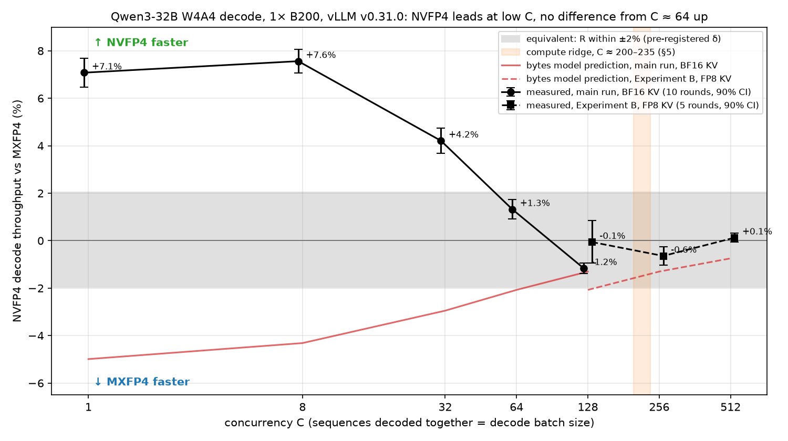
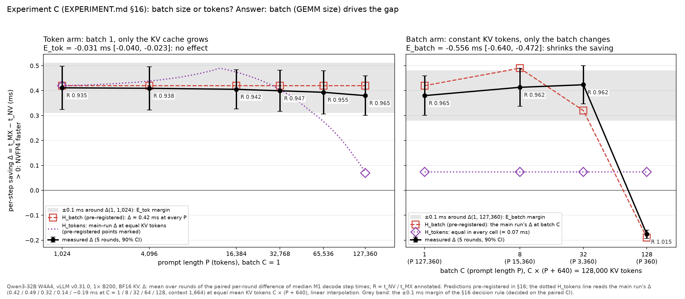

# Results: NVFP4 vs MXFP4 decode on B200 (Qwen3-32B, vLLM v0.31.0)

> **Status 2026-10-05 13:10 EDT: final.** Main run `full-1` (10 rounds, after the pre-registered
> extension), Experiment B `expb-1`, the kernel microbenchmark and the profiling sessions are all
> complete. All numbers were cross-checked against the raw outputs by an independent pass
> (5-round version; the 10-round numbers come from the same analysis code).

Conventions: every ratio is oriented so that **> 1 means the second-named treatment is faster**
(R = t_NV / t_MX > 1: MXFP4 faster). "X% faster" means a step-time reduction of X% (1 − ratio);
the throughput gain is larger (R = 0.930 ≈ 7.5% more tok/s). CIs on step-time ratios are 90%
(TOST, §8); the NLL difference CI is a 95% paired bootstrap.

## TL;DR

1. **On decode-bound Qwen3-32B in vLLM v0.31.0 on B200, NVFP4 is faster than MXFP4 at low
   concurrency, not equal and not slower:** R = t_NV/t_MX = 0.930 [0.926, 0.934] at C = 8 and
   0.960 [0.955, 0.965] at C = 32 (10 rounds); equivalent at C = 64 (0.987) and C = 128 (1.012, a
   small within-δ MXFP4 edge). The bytes model (MXFP4 up to 5% faster) is contradicted in sign at
   C ≤ 64. **Caveat:** the A/A gate G3 still fails after the pre-registered 10-round extension,
   only on its "CI must contain 1" clause at C = 32 (+0.32%) and C = 64 (−0.44%); every A/A CI is
   within ±0.6%. Under the letter of the pre-registration the H_eq verdict is therefore *not
   interpretable*; a post-hoc check shows R's verdicts do not change whichever MXFP4 server
   (MX, MX′ or both pooled) is the baseline.
2. **It is not the bytes, and mostly not the GEMM.** Decode reaches only 38–62% of 8 TB/s. In the
   profiles, 69–83% of NVFP4's low-C lead (with the fusion matched) is outside the FP4 GEMMs:
   MXFP4's slower activation quantization, extra kernels and in-graph gaps. vLLM's NVFP4-only
   SiLU·mul + quant fusion is worth ~0.4–1.1% (Φ); with it matched, NVFP4 is still 5.8% / 6.2% /
   3.0% faster at C = 1 / 8 / 32 (F).
3. **Kernel choice matters more than format.** NVFP4 on its next-best vLLM kernel (cuDNN) is
   10–18% slower than on CuTe-DSL at C ≤ 32 (K), and MXFP4 then beats it at every C
   (D = 1.03–1.10). At C ≤ 32 the kernel moves NVFP4's step ~2.1–2.7× more than the format does.
4. **Above the compute ridge (Experiment B: C = 256/512, FP8 KV) the formats are equivalent**
   (R_B = 1.0065 and 0.9987, CIs within ±0.4%; all gates pass). Stas's ~9% MAMF advantage does
   not appear: in vLLM's CuTe-DSL kernels NVFP4's gate_up/down GEMMs are ~9% *slower* at this
   batch, and its fused activation path approximately offsets that. Experiment B ran
   power-capped (95–99% of every window).
5. **Kernel level:** at M = 1 on gate_up both formats' vLLM GEMMs run at the same ~77% of HBM
   bandwidth, so MXFP4 is faster by the bytes ratio (1.060); everywhere else kernel efficiency
   (tactic choice, library) dominates, in both directions. In PyTorch 2.13 (this image), a
   MAMF-style comparison pits cuBLASLt (NVFP4) against MSLK's CUTLASS kernel (MXFP4): two
   different libraries. (Stas measured with torch 2.14; not checked here.)
6. **Accuracy:** NVFP4's NLL penalty over BF16 is 0.051 vs MXFP4's 0.136 nats/token (~2.7× smaller).
7. **Batch size, not tokens, drives the gap (Experiment C, all gates pass):** at batch 1 NVFP4
   saves the same ~0.4 ms/step from 1k to 127k tokens (only R dilutes); at a constant 128k tokens
   the saving survives to batch 32 and reverses at batch 128.
8. **vLLM's MXFP4 GEMM autotuning is nondeterministic across server starts** (a different tactic
   cache on 20 of 20 MXFP4 starts; C = 1 step 5.99–6.26 ms), while NVFP4's CuTe-DSL GEMM is not
   autotuned (one cache, step within ±0.05% on a GPU and ~1% across GPUs). This is what makes the
   A/A control noisy.

*NVFP4's M1 decode-throughput advantage over MXFP4 ((t_MX / t_NV − 1), i.e. R with its 90% CI
re-expressed) against concurrency. Grey: the pre-registered ±2% equivalence band. Red: what the
bytes model predicted (MXFP4 faster). Regenerate with `fp4bench plot overview data/runs/full-1
data/runs/expb-1`.*

## Main experiment (EXPERIMENT.md §3–§9) — `full-1`, 10 rounds

Data: `results/full-1/` (rounds 0–4 on one B200 00:16–06:18 EDT; rounds 5–9 after the
pre-registered extension, 06:20–12:54, rounds 5–8 on a second B200; a Modal interruption during
round 9 at 11:33 restarted the container and round 9 was re-run whole on a third B200). 50 sessions
counted, no failed session. The 5-round snapshot is kept in `results/full-1-5rounds-snapshot/`.

**Gates:** G1 (exact kernel class, fusion audit, NV-nf compile-cache check), G2, G4 (no
environmental throttling), G5a, G5b, G6a (no preemptions, KV capacity) and G7 (each round on one
GPU within one start) pass. **G3 (A/A) fails.** G6b (M2 validity, non-blocking) fails: 74 of 250
M2 cells are invalid (70 `underfilled`, 2 `underfilled` + `capacity_limited`, 2 loop-detected with
request errors).

**G3 after 10 rounds (A/A t_MX′ / t_MX, 90% CI):**

| C | A/A | 90% CI | G3 at this C |
|---|---|---|---|
| 1 | 0.9918 | [0.9820, 1.0016] | passes (failed at 5 rounds: [0.9681, 1.0046]) |
| 8 | 0.9971 | [0.9910, 1.0032] | passes |
| 32 | 1.0032 | [1.0009, 1.0055] | **fails**: inside ±2% but excludes 1 |
| 64 | 0.9956 | [0.9916, 0.9997] | **fails**: inside ±2% but excludes 1 |
| 128 | 1.0008 | [0.9981, 1.0036] | passes |

- The pre-registered remedy (§9: add rounds; 10, as in §8) was applied and the gate still fails.
  The pre-registration names no further step, so **the H_eq verdict is formally not
  interpretable**. The failures are tiny (+0.32% and −0.44%), 9–20× smaller than R's effects at
  C ≤ 32, and every A/A CI is inside ±0.6%.
- **Source of the A/A noise: MXFP4 autotuning.** Each server start gets a fresh FlashInfer
  autotune (pre-registered, §7.7). All 20 MX/MX′ starts produced a different autotune cache, and
  the MXFP4 C = 1 step ranged 5.99–6.26 ms. NV and NV-nf are not GEMM-autotuned by vLLM
  (`skip_ops={"fp4_gemm"}`): one autotune cache across all 10 starts, C = 1 step 5.755–5.810 ms
  (the spread is between the three GPUs; within a GPU it repeats to ±0.05%).
- **Post-hoc robustness (not pre-registered):** R against MX′ instead of MX, or against the
  geometric mean of MX and MX′ per round, gives the same verdict at every C:

  | C | R vs MX (registered) | R vs MX′ | R vs pooled MX, MX′ |
  |---|---|---|---|
  | 1 | 0.9339 [0.9286, 0.9392] | 0.9416 [0.9324, 0.9510] | 0.9378 [0.9318, 0.9438] |
  | 8 | 0.9297 [0.9255, 0.9339] | 0.9324 [0.9288, 0.9360] | 0.9310 [0.9283, 0.9338] |
  | 32 | 0.9596 [0.9547, 0.9645] | 0.9565 [0.9506, 0.9624] | 0.9580 [0.9527, 0.9634] |
  | 64 | 0.9869 [0.9830, 0.9909] | 0.9913 [0.9883, 0.9943] | 0.9891 [0.9862, 0.9920] |
  | 128 | 1.0118 [1.0094, 1.0141] | 1.0109 [1.0097, 1.0122] | 1.0113 [1.0101, 1.0126] |

- Design lesson: requiring "CI contains 1" at all 5 C has a family-wise false-failure rate of up
  to ~41% (1 − 0.9⁵; less because the C share sessions) even with no A/A difference, and with
  tighter CIs any real sub-0.5% difference between two server starts (e.g. an autotune draw or a
  schedule-position effect) fails it. An equivalence-only A/A criterion would have passed at every C.

**Primary result — R = t_NV / t_MX (M1, 10 rounds, 90% CI), with F and Φ (Q4):**

| C | R | 90% CI | verdict (§8) | R_ideal (bytes) | F = t_NVnf / t_MX | Φ = t_NV / t_NVnf |
|---|---|---|---|---|---|---|
| 1 (secondary) | **0.9339** | [0.9286, 0.9392] | NVFP4 faster | 1.0525 | 0.9425 [0.9372, 0.9479] | 0.9908 [0.9904, 0.9913] |
| **8** | **0.9297** | [0.9255, 0.9339] | **NVFP4 faster** | 1.0451 | 0.9377 [0.9337, 0.9416] | 0.9915 [0.9910, 0.9920] |
| **32** | **0.9596** | [0.9547, 0.9645] | **NVFP4 faster** | 1.0304 | 0.9699 [0.9650, 0.9747] | 0.9894 [0.9885, 0.9903] |
| 64 (secondary) | 0.9869 | [0.9830, 0.9909] | equivalent | 1.0212 | 0.9970 [0.9934, 1.0007] | 0.9899 [0.9888, 0.9910] |
| **128** | **1.0118** | [1.0094, 1.0141] | **equivalent** | 1.0132 | 1.0160 [1.0140, 1.0180] | 0.9958 [0.9950, 0.9967] |

**What the pre-registered decision rules would say if G3 passed:** H_eq **nullified in the
direction of H_nv**: NVFP4 is practically faster at two of the three primary endpoints (C = 8:
−7.0%; C = 32: −4.0%) and equivalent at C = 128. **H_mx (bytes model) is contradicted** at
C ≤ 64: it predicted R ≈ 1.02–1.05 (MXFP4 faster), the opposite sign. At C = 128 R excludes 1 in
MXFP4's favour (1.2%, within δ, just under the bytes model's 1.3% bound): the NVFP4 advantage
shrinks with C and reverses to a small, practically irrelevant MXFP4 edge.

**Decomposition (Q2–Q4):**
- **Fusion (Φ):** vLLM's NVFP4-only SiLU·mul + quant fusion is worth 0.4–1.1% (Φ = 0.989–0.996,
  Equivalent at every C, every CI excluding 1). **With the fusion matched (F), NVFP4 is still
  5.8% / 6.2% / 3.0% faster at C = 1 / 8 / 32**; F is Equivalent at C = 64 and 128 (at 128 MXFP4 is
  1.6% faster, within δ).
- **Kernel sensitivity (K) and NV-alt (D):** NVFP4 on cuDNN (the kernel the pre-registered scan
  selected) is 17.6% / 15.0% / 9.8% / 5.9% / 2.0% slower than on CuTe-DSL at C = 1/8/32/64/128
  (K = 1.176 … 1.020; "pinned faster" at C ≤ 64, "different, small" at 128). So **D = t_NValt /
  t_MX = 1.098 / 1.069 / 1.053 / 1.045 / 1.032: on that kernel, MXFP4 wins at every C.** At C ≤ 32
  the kernel choice moves NVFP4's step ~2.1–2.7× more than the format choice: the decode-time
  version of Stas's "software difference".
- **Profiling (§15, single sessions) attributes the gaps.** For F (NV-nf − MX, fusion matched):
  at C = 1 the −399 µs/step gap is FP4 GEMM −124 (31%), activation quant + SiLU·mul −51, other
  kernels −81 (mostly a ~1 µs Inductor kernel MX runs before every o_proj), in-graph gaps −127
  (MX runs 65 more kernels per step); at C = 32 (−427) the GEMM is −73 (17%) and the activation
  path −127. So 69–83% of F's gap is outside the FP4 GEMMs. For R (NV − MX), the activation path
  saves more (−130 at C = 1, −249 at C = 32), NV runs 129 fewer kernels per step (916 vs 1045), and
  in-graph gaps shrink by 98 / 89 µs. Per layer, MXFP4's gate_up GEMM is ~6% faster (≈ the bytes
  ratio) while NVFP4's down_proj (~10%) and qkv (~8%) GEMMs are faster. The per-layer GEMM
  differences are comparable to MXFP4's start-to-start autotune spread, so they are indicative,
  not precise.
- **Bandwidth:** effective HBM bandwidth (bytes model / M1 step) is 38–62% of 8 TB/s (MX 37.5% at
  C = 1 → 61.9% at C = 128; NV 42.3% → 62.0%). Decode here is not bandwidth-bound, so H_mx's
  premise does not hold; NVFP4 is faster at low C despite moving 5.9% more weight bytes.
- **Power:** at C = 128 every treatment is at the 1000 W software power cap for most of each M1
  window, NVFP4 treatments more (NV / NV-nf 98.3–99.0%; MX / MX′ / NV-alt 92.5–97.5%; at C = 64
  18.6–19.3% vs 16.5–17.7%; C ≤ 32 ≤ 14%). G4 reports SW power capping without discarding
  (environmental throttling counters were 0). R's convergence at C = 128 coincides with this
  power-limited regime; consistent with, not proof of, a power-limit explanation.

**M2 (llm-inference-bench, secondary):** where it has paired valid cells it agrees with M1:
tok/s MX/NV = 0.936 [0.932, 0.941] at C = 1 (10 rounds), 0.932 [0.923, 0.941] at C = 8 (6),
0.991 [0.988, 0.994] at C = 64 (9). It gives **no MX/NV comparison at the primary C = 32
(0 paired rounds) or C = 128 (1)**: with 2048-token streams in a 30 s window, streams finish and
restart mid-window and effective concurrency falls to ~94–98% of C (the 10 s smoke windows never
hit this).

**Accuracy (descriptive):** mean NLL on 64 ShareGPT windows: BF16 1.7730, **MXFP4 1.9092
(+0.136)**, **NVFP4 1.8238 (+0.051)**; NV − MX = −0.0853 nats/token, 95% bootstrap CI
[−0.0965, −0.0744]. NVFP4's excess NLL over BF16 is ~2.7× smaller for this W4A4 recipe. (Observation: the
per-window NLL is bitwise identical across NV, NV-alt and NV-nf, i.e. across two different GEMM
libraries and with the fusion on or off, and across all MX/MX′ sessions. Plausible, since FP4
block products accumulate almost exactly in FP32 before the BF16 output rounding, but not
verified beyond this.)

## Experiment B: high batch, FP8 KV (EXPERIMENT.md §13) — `expb-1`

**Verdict: H_B,eq validated — R_B is Equivalent at both primary C (256, 512). NVFP4's MAMF
advantage does not appear in end-to-end decode above the compute ridge.** All blocking gates pass
(G1 incl. the fusion audit, G2, G3, G4, G5a, G5b, G6a incl. KV capacity and zero preemptions, G7);
G6b (M2 validity, non-blocking) fails, see below.

| C | R_B = t_NV / t_MX (90% CI) | verdict | A/A t_MX′ / t_MX (90% CI) | R_ideal (bytes, FP8 KV) | MX step |
|---|---|---|---|---|---|
| 128 | 1.0006 [0.9917, 1.0096] | equivalent | 1.0002 [0.9915, 1.0090] | 1.021 | 11.33 ms |
| **256** | **1.0065 [1.0026, 1.0103]** | **equivalent** | 0.9986 [0.9936, 1.0036] | 1.013 | 17.18 ms |
| **512** | **0.9987 [0.9969, 1.0006]** | **equivalent** | 0.9986 [0.9954, 1.0018] | 1.0075 | 30.83 ms |

- **The pre-registered prediction R_B(512) ≈ 0.973–0.987 missed on the high side** (0.9987). It
  assumed NVFP4's GEMMs would be up to 9% *faster* (MAMF). In vLLM's kernels they are slower at
  this batch: profiling at C = 512 shows +632 µs/step of FP4 GEMM for NV (gate_up +420, down +205;
  8.7%), and the microbenchmark gives t_NV/t_MX = 1.19–1.20 on gate_up/down at M = 512 (qkv is the
  exception: 0.97). NV's fused SiLU·mul + quant saves −489 µs; net kernel time is +140 µs, and with
  ~104 µs less idle the profiled spans come out equal: the effects approximately cancel.
- R_B(256) excludes 1 (MXFP4 0.65% faster in all 5 rounds), within δ.
- **GEMM share:** the profile gives s = 0.30 (MX) / 0.33 (NV), but its window had a shorter
  context (~1.0–1.1k tokens) than M1 (1.15–2.18k; profile span 23.8 ms vs M1 step 30.8 ms).
  Scaled to M1's step, s ≈ 0.24–0.26, mid-range of §13's assumed 0.15–0.30; attention takes ~47%
  of the profiled step and more at M1's context. Effective bandwidth is 51–54% of 8 TB/s for both
  formats at every C.
- **Power:** every treatment is at the SW power cap for 95–99% of every Experiment B window; the
  equivalence was measured in a power-limited regime.
- **Capacity / integrity:** FP8 KV pools of 1,190,176–1,193,760 tokens (≥ 1,114,112 required), no
  preemption in any M1 block or M2 cell. Attention: FlashInfer, decode backend trtllm-gen with an
  FP8 query.
- **Accuracy with uncalibrated FP8 KV (scales 1.0):** MX 1.9131, NV 1.8276 nats/token
  (BF16 reference 1.7730); NV − MX = −0.0855 (95% bootstrap [−0.0962, −0.0751]). Against the main
  run's BF16-KV NLL (MX 1.9092, NV 1.8238; `--reference-run results/full-1`), FP8 KV costs
  +0.0039 / +0.0038 nats/token.
- **M2 (secondary):** 22 of 45 cells invalid (21 `underfilled`, 1 loop-detected: round 2, MX′,
  C = 512). Only C = 512 has paired valid MX/NV rounds: tok/s MX/NV = 1.0018 [0.9836, 1.0204]
  (5 rounds, "inconclusive" by §8, centred on 1). MX at C = 512 sustains ~19.5k tok/s.

## Experiment C: batch size or tokens? (EXPERIMENT.md §16) — `expc-1`

Follow-up to Stas Bekman's question *"is it batch size or the number of tokens that changes the
gap?"*. Token arm: batch fixed at 1 (every GEMM at M = 1), prompt length 1k → 127k, so only the KV
cache grows. Batch arm: constant 128k mean KV tokens, batch 1 / 8 / 32 / 128. Treatments MX, NV, MX′;
5 rounds; M1 only; context limit raised with a `max_position_embeddings` override (stock RoPE, no
YaRN). Primary metric: NVFP4's absolute per-step saving Δ = t_MX − t_NV.

**Answer (pre-registered rules): batch size (GEMM size) drives the gap, not the number of tokens.**
All gates pass (G1–G7, incl. the amended A/A-on-effects G3); the config reproduces the main run's
batch-1 R (0.9354 vs 0.934).

| | definition | mean | 90% CI | classification | H_batch predicted | H_tokens predicted |
|---|---|---|---|---|---|---|
| **E_tok** | Δ(1, 127k) − Δ(1, 1k) | −0.031 ms | [−0.040, −0.023] | **no effect** (inside ±0.1 ms) | ≈ 0 | ≈ −0.35 ms |
| **E_batch** | Δ(128, 360) − Δ(1, 127k) | −0.556 ms | [−0.640, −0.472] | **shrinks the saving** | ≈ −0.60 ms | ≈ 0 |
| A/A E_tok,AA | MX′ vs MX | −0.003 ms | [−0.011, +0.006] | G3 pass | | |
| A/A E_batch,AA | MX′ vs MX | +0.020 ms | [−0.055, +0.095] | G3 pass | | |

| cell (batch × prompt) | Δ = t_MX − t_NV | R = t_NV / t_MX |
|---|---|---|
| 1 × 1k | +0.411 ms | 0.935 |
| 1 × 4k | +0.409 | 0.938 |
| 1 × 16k | +0.405 | 0.942 |
| 1 × 32k | +0.399 | 0.947 |
| 1 × 64k | +0.393 | 0.955 |
| 1 × 127k | +0.380 | 0.965 |
| 8 × 15k (128k tokens) | +0.413 | 0.962 |
| 32 × 3.4k (128k tokens) | +0.423 | 0.962 |
| 128 × 360 (128k tokens) | **−0.176** | **1.015** |

(Per-cell Δ CIs are about ±0.08 ms because MXFP4's autotune draw differs per server start; the
effects are paired within a server, so their CIs are much tighter.)

- **Tokens only dilute.** At batch 1, NVFP4 saves the same ~0.4 ms per step from 1k to 127k tokens
  (a tiny −0.03 ms drift); R moves from 0.935 to 0.965 only because the step gets longer
  (attention reads the larger KV cache at ~7 TB/s here, faster than the 4.5 TB/s assumed).
- **Batch flips it.** At the same 128k KV tokens, the saving holds up to batch 32 and is gone
  (reversed to −0.18 ms, MXFP4 1.5% faster) at batch 128: the change happens between M = 32 and
  M = 128, consistent with the microbenchmark, where vLLM's untuned NVFP4 GEMMs become slower than
  MXFP4's autotuned ones from M ≈ 64.
- **Power:** the M1 windows include the prefills, and long prefills run at the 1000 W cap: the
  capped fraction rises with prompt length at batch 1 (1% at 1k → 70% at 127k) and is 89–97% at
  batch 128 (NVFP4 sessions slightly more). Reported, not gated; it is the same for both formats
  in the token arm, where Δ does not move.

## Kernel microbenchmark (EXPERIMENT.md §14)

Data: `results/microbench-1/` (primary) and `results/microbench-1/replicate/` (a second full grid
on another B200 container). For each (shape, M) the same BF16 source tensors are quantized to both
formats (NVFP4 then has 5.9% more bytes); CUDA graphs; ≥ 2× L2 rotation; 7 samples per cell. Within
a run the min–max at small M is < 1%, but **medians differ between containers by up to ~17% at
small M and ~22% at large M** (autotuner choices, and also some cuBLASLt/MSLK cells), so only
patterns that hold in both runs are stated as findings.

**The pre-registered bytes test cannot be applied as written:** no GEMM reaches 80% of 8 TB/s
(best: 77%, gate_up at M = 1). For reference (not pre-registered), a 4 GiB device-to-device copy
reaches only 6.66 TB/s (83%), so the threshold sits near the practical ceiling.

**Small M (t_NV / t_MX at M = 1 / 8 / 32):**

| | gate_up | down | qkv |
|---|---|---|---|
| (a) vLLM as deployed (MX autotuned, NV heuristic) | 1.060 / 1.052 / 1.034 | **0.884 / 0.907 / 0.970** | 1.042 / 1.017 / 1.054 |
| (a′) vLLM path, both autotuned | 1.100 / 1.049 / 1.033 | 1.068 / 1.064 / 1.061 (replicate 1.051 / 1.026 / 0.942) | **1.218 / 1.219 / 1.171** |
| (c) FlashInfer cuDNN backend | 0.733 / 0.728 / 0.775 | 0.856 / 0.868 / 0.863 | 0.984 / 0.776 / 0.919 |
| (b) MAMF-style (NV cuBLASLt vs MX MSLK CUTLASS) | 0.672 / 0.691 / 0.718 | 0.963 / 0.941 / 0.952 | 0.778 / 0.752 / 0.798 |

- **gate_up, M = 1, path (a):** both formats reach the same ~77% of 8 TB/s, so t_NV/t_MX equals the
  bytes ratio (1.060 vs 1.059; replicate 1.058). At M = 8–32 both stay at 73–74% while the ratio
  falls to 1.03–1.05: NVFP4's kernel is slightly more efficient there.
- **(a) as deployed:** vLLM autotunes the MXFP4 GEMM but runs NVFP4's CuTe-DSL GEMM on its
  heuristic tactic. On down_proj (K = 25600) the heuristic NVFP4 GEMM takes ~12% less time than the
  autotuned MXFP4 one at M = 1 (replicate: the same). Autotuning NVFP4 makes it *slower* on qkv
  and on gate_up at M = 1 (a′).
- **(b):** in PyTorch 2.13 on CUDA, NVFP4 `_scaled_mm` runs cuBLASLt kernels while MXFP4
  `_scaled_mm_v2` with `BlockWise1x32` runs MSLK's CUTLASS `f4f4bf16`. At small M the cuBLASLt
  NVFP4 kernel is 28–33% faster on gate_up: a library difference, not a format difference.
- **(c):** cuDNN's NVFP4 path dispatched to cuBLASLt kernels in 42 of 49 cells, its MXFP4 path to
  cuDNN-generated kernels, so (c) is not a same-kernel comparison either.

**Compute-bound (t_NV / t_MX at M = 512):**

| | gate_up | down | qkv |
|---|---|---|---|
| (a) vLLM as deployed | 1.186 | 1.196 | 0.970 |
| (a′) both autotuned | 1.203 | 1.044 | 0.981 |
| (c) cuDNN | 0.870 | 0.700 | 0.899 |
| (b) MAMF-style | 0.829 | 1.092 (replicate 0.931) | 0.739 |

- In vLLM's CuTe-DSL kernels, NVFP4's gate_up and down GEMMs are 4–20% *slower* than MXFP4's at
  M = 512 (qkv: 2–3% faster). Through cuDNN NVFP4 is faster on every shape (0.70–0.90).
- Pre-registered §14 prediction for (b), "NVFP4 ~9% faster at large M": exceeded on gate_up (17%)
  and qkv (26%), mixed on down_proj (1.092, replicate 0.931; and 0.511 at M = 256).
- Peak observed: 4.7–5.0 PFLOPS (MX CuTe-DSL, gate_up, M = 512; primary / replicate).

**Activation quantization:** vLLM's NVFP4 `scaled_fp4_quant` is faster than FlashInfer's MXFP4
CuTe-DSL quantize in 20 of 21 cells (replicate 19/21; t_NV/t_MX 0.73–1.00; 1.7–7.7 µs). The fused
NVFP4 SiLU·mul + quantize on the down_proj input is 1.9–3.2× faster than MXFP4's deployed
two-kernel path (3.1 vs 5.9 µs at M = 1; 15.9 vs 50.8 µs at M = 512), as predicted. (MXFP4's
SiLU·mul was approximated with `torch.compile` of vLLM's native op, since the servers run Inductor
for it; not byte-identical to vLLM's compiled graph.)

## Profiling (EXPERIMENT.md §15)

Data: `results/profile-1/`. vLLM torch profiler, 32 pure-decode steps per session
(graph-replayed kernels are visible; every step is a full CUDA-graph replay with a constant kernel
count), **one session per (treatment, config)**. µs per decode step:

| session | FP4 GEMM | act quant | SiLU·mul | attention | BF16 GEMM (lm_head) | norm/rope/elementwise | Σ kernels | idle | span |
|---|---|---|---|---|---|---|---|---|---|
| MX, C = 1 | 3740 | 596 | 101 | 685 | 232 | 642 | 6078 | 430 | 6475 |
| NV, C = 1 | 3640 | 567 | 0 (fused) | 693 | 233 | 573 | 5786 | 327 | 6066 |
| NV-nf, C = 1 | 3616 | 541 | 105 | 680 | 232 | 566 | 5823 | 302 | 6076 |
| MX, C = 32 | 3958 | 707 | 138 | 2007 | 247 | 632 | 7814 | 341 | 8119 |
| NV, C = 32 | 3887 | 597 | 0 (fused) | 2014 | 248 | 566 | 7431 | 255 | 7628 |
| NV-nf, C = 32 | 3884 | 577 | 142 | 2011 | 248 | 561 | 7548 | 208 | 7692 |
| MX, C = 512, FP8 KV | 7242 | 1223 | 970 | 11289 | 570 | 1934 | 23493 | 414 | 23836 |
| NV, C = 512, FP8 KV | 7875 | 1704 | 0 (fused) | 11276 | 574 | 1927 | 23632 | 310 | 23836 |

- **Low-C decode is GPU-kernel-bound, not CPU-bound:** the GPU is busy 93–97% of the step. But the
  FP4 GEMMs stream the weights at only 4.2–4.8 TB/s (52–60% of 8 TB/s), and 35–48% of the step is
  non-GEMM kernel work (activation quant, SiLU·mul, attention, norms, lm_head, sampling). That is
  why the bytes model's premise is not met.
- **NV − MX at C = 1 (−409 µs/step):** FP4 GEMM −100, activation quant + SiLU·mul −130, other
  kernels −62, idle −103 (of which in-graph −98). **At C = 32 (−491):** GEMM −70, activation path
  −249, other −65, idle −86 (in-graph −89). The GEMM differences are comparable to MX's
  start-to-start autotune spread (~70 µs; NV's < 1 µs).
- **Fusion (NV − NV-nf):** saves ~80 µs of kernel time at C = 1 and ~122 µs at C = 32, but only
  ~9 µs and ~64 µs of span.
- **C = 512:** see Experiment B. NV's FP4 GEMMs +632 µs (+8.7%), fused activation path −489 µs,
  equal spans.
- **Caveat:** these are single sessions. Their own unprofiled reference waves (one pair each)
  disagree with M1 by up to ~5% (e.g. NV/NV-nf at C = 32: 1.046 vs M1's Φ = 0.990), and the
  profiler inflates between-step idle; use them for attribution, not for ratios.

## What this means for the original question

- **"On decode-bound workloads there shouldn't be an advantage for either NVFP4 or MXFP4":** not
  supported in vLLM v0.31.0 on B200 for a dense 32B model (subject to the G3 caveat above). NVFP4
  is 4–7% faster at C = 1–32; the formats are within ±1.2% at C ≥ 64 and above the compute ridge.
- **But the reason is software, not the format:** decode never reaches the bandwidth-bound regime
  where the format's bytes would decide (MXFP4 *is* 6% faster on the one GEMM that runs both
  formats at equal efficiency), and NVFP4's lead comes mostly from vLLM's surrounding kernels: a
  faster activation quantizer, the NVFP4-only fusion, fewer kernels per step. NVFP4 on another
  vLLM kernel loses to MXFP4 at every C. The same experiment on a stack where MXFP4 gets equal
  kernel attention could well come out the other way at low C.
- **Stas's ~9% MAMF advantage does not carry over to decode**, neither at low C (the GEMMs differ
  by ~2–3%, in mixed directions) nor above the ridge (Experiment B: equivalent; vLLM's NVFP4
  GEMMs are slower there). In PyTorch 2.13 the MAMF-style comparison is cross-library.
- **Accuracy favours NVFP4** clearly for this W4A4 recipe (NLL penalty 0.051 vs 0.136).
- **For vLLM:** MXFP4 would gain from a faster activation quantizer, a dense SiLU·mul + MXFP4
  quant fusion, and deterministic (or cached) GEMM autotuning; NVFP4's CuTe-DSL GEMM would gain
  from autotuning at large M.
